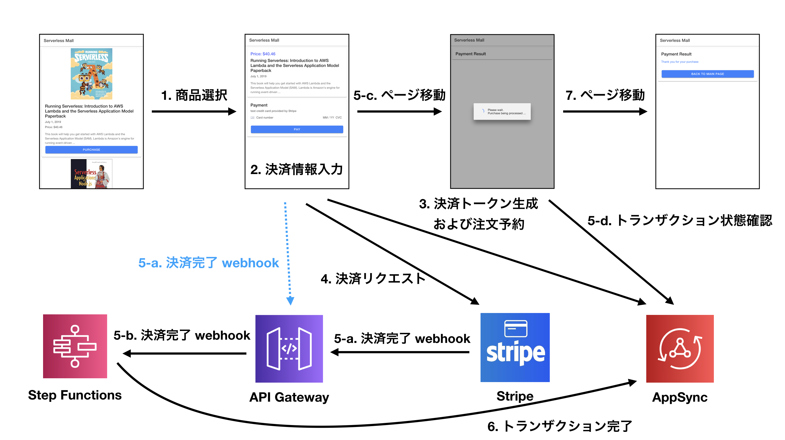
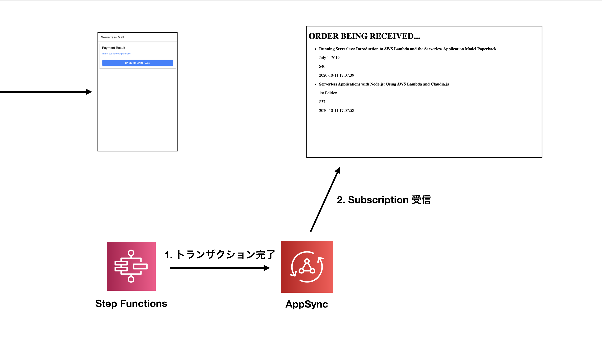

# AWS CDK + AWS AppSync + AWS Step Functions で作った注文サービスデモプロジェクト

## プロジェクト概要

- AWS Community Day Online 2020 にて公開したデモプロジェクトの Github レポジトリーです。
- AWS CDK で構築した AWS Step Functions や AWS AppSync のサンプルコードとしても活用することができます。

## アーキテクチャー


## 実行の流れ

[DEMO 動画](https://www.youtube.com/watch?v=kuTyxcjqeUk)

### Ionic アプリ

本番環境ではない開発（テスト）環境では Stripe の webhook 有効化ができず、このデモでは `5-a. 決済完了 webhook` を Ionic アプリから直接リクエストする方式で実装しました。




### 管理者 Web


## デモ実行環境

- `Mac OS X 10.15.7` にて Build しました。
- `AWS CDK CLI` は `1.66.0 (build 459488d)` を使いました。 **(CDK はバージョンが少しでも異なったら Build ができなくなることがありますので要注意です)**
- `ionic` は `5.4.16` を使いました。
- `Angular CLI` は `9.0.5` を使いました。
- `Node` は `12.16.1` を使いました。

## 実行方法

先ず、本プロジェクトをロカル環境に `git clone` します。

各プロジェクトは以下のようにデプロイ、実行します。

### 1. backend
- `npm i` もしくは `yarn` コマンドにて依存関係のパッケージをインストールします。
- `make` コマンドにて Lambda 関数をパッケージングします。
- `cdk deploy appsync-stack` にて AppSync スタックをデプロイします。デプロイ完了段階で出力される `appsync-stack.GraphQLAPIKeydev` および `appsync-stack.GraphQLAPIURLdev` をどこかにコピーしておきます。
- `cdk deploy stepf-stack` にて Step Functions スタックをデプロイします。デプロイ完了段階で出力される `stepf-stack.awscommday2020stepfhttpendpointdevEndpoint***` をどこかにコピーしておきます。

### 2. ionic
- `npm i` もしくは `yarn` コマンドにて依存関係のパッケージをインストールします。
- `src/aws-exports.ts` に AppSync スタックをデプロイした際コピーしておいた `aws_appsync_apiKey` および `aws_appsync_graphqlEndpoint`、そして Step Functions スタックをデプロイした際にコピーしておいた `custom_stripe_webhook_url` を入力します。 `aws_project_region` および `aws_appsync_region` ではデプロイしたリージョン (例えば, 東京リージョンの場合 `ap-northeast-1`) を入力します。入力の例は以下をご参照ください。
```json
export default {
    "aws_project_region": "ap-northeast-1",
    "aws_appsync_graphqlEndpoint": "https://l6mkmhmyn5esdbct37s2gr2zwa.appsync-api.ap-northeast-1.amazonaws.com/graphql",
    "aws_appsync_region": "ap-northeast-1",
    "aws_appsync_authenticationType": "API_KEY",
    "aws_appsync_apiKey": "da2-jp7t5h6zzndbbhnuvmoytsx2wq",
    "custom_stripe_webhook_url": "https://tcmnq4u4ql.execute-api.ap-northeast-1.amazonaws.com/dev/"
}
```
- `ionic serve` にて Ionic アプリを Web ブラウザーからアクセスします。

### 3. admin
- `npm i` もしくは `yarn` コマンドにて依存関係のパッケージをインストールします。
- `src/aws-exports.ts` に AppSync スタックをデプロイした際コピーしておいた `aws_appsync_apiKey` および `aws_appsync_graphqlEndpoint` を入力します。 `aws_project_region` および `aws_appsync_region` ではデプロイしたリージョン(例えば, 東京リージョンの場合 `ap-northeast-1`) を入力します。入力の例は以下をご参照ください。
```json
export default {
    "aws_project_region": "ap-northeast-1",
    "aws_appsync_graphqlEndpoint": "https://l6mkmhmyn5esdbct37s2gr2zwa.appsync-api.ap-northeast-1.amazonaws.com/graphql",
    "aws_appsync_region": "ap-northeast-1",
    "aws_appsync_authenticationType": "API_KEY",
    "aws_appsync_apiKey": "da2-jp7t5h6zzndbbhnuvmoytsx2wq"
}
```
- `ng serve` にて管理者 Web を Web ブラウザーからアクセスします。

## Stripe カード決済テスト
- Stripe で提供しているテストカードの番号は以下となります。


## Amplify を活用した AppSync API 自動作成
- AWS AppSync CLI および Amplify CLI を活用すると、`amplify init` 無しで `amplify codegen` を使うことができます。
- 先ず, プロジェクトルートで `schema.json` を以下コマンドで生成します。
```sh
$ aws appsync get-introspection-schema --api-id ${APPSYNC_APP_ID} --format JSON schema.json
```
- `schema.json` が生成されましたら API コードを生成します。
```sh
$ amplify codegen add
```
- 一度だけ上記コードを実行しておけば、AppSync の GraphQL スキーマが変更されるたびに以下のコマンドにて API コードを更新します。
```sh
$ aws appsync get-introspection-schema --api-id ${APPSYNC_APP_ID} --format JSON schema.json

$ amplify codegen
```


## CDK スタック削除
- `cdk destroy stepf-stack`
- `cdk destroy appsync-stack`