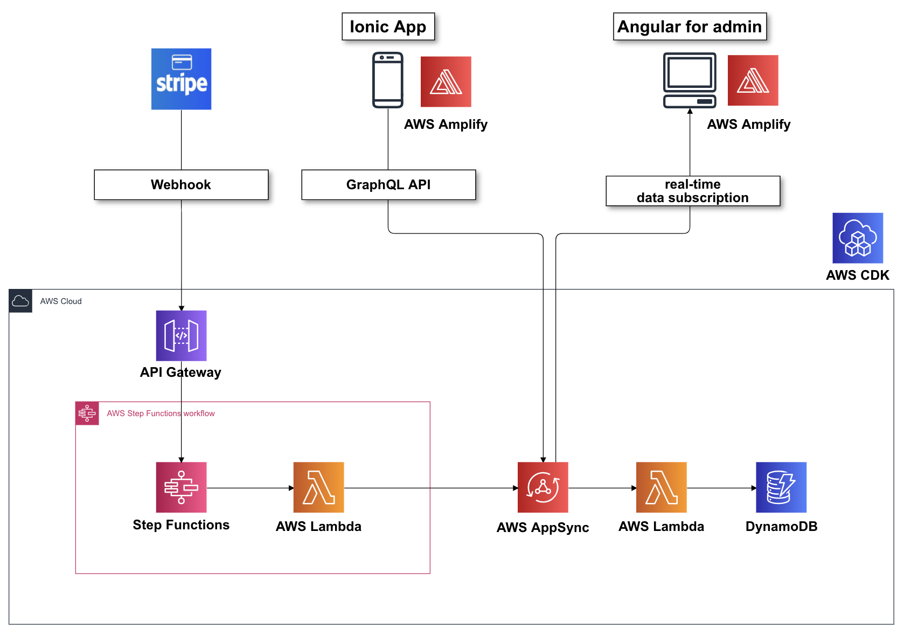
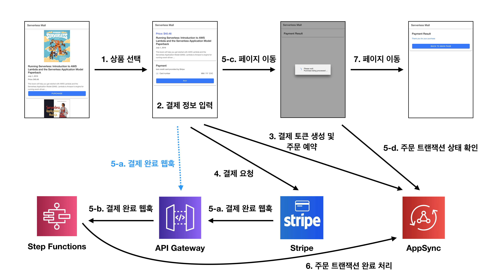
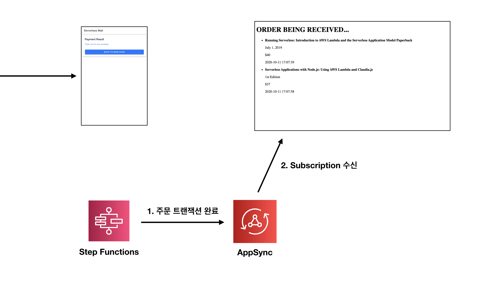
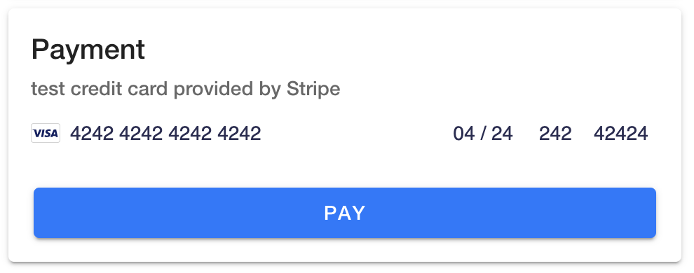

# 온라인 주문 서비스를 서버리스 아키텍쳐로 구축하기 데모 프로젝트

## 프로젝트 개요

- AWS Community Day Online 2020 에서 공개한 데모 프로젝트의 Github 레포지토리입니다. 
- AWS CDK 로 구축한 Step Functions 및 AppSync 의 샘플 코드로 활용할 수 있습니다.

## 아키텍쳐



## 실행 흐름

### 아이오닉 앱

프로덕션 환경이 아닌 개발(테스트) 환경에서는 Stripe 의 webhook 기능을 활용할 수 없어서, 본 데모에서는 `5-a. 결제 완료 웹훅` 부분을 ionic 앱에서 직접 요청하는 방식으로 시연하였습니다.




### 어드민


## 데모 시연시의 빌드 환경

- `Mac OS X 10.15.7` 에서 빌드합니다. 
- `AWS CDK CLI` 는 `1.66.0 (build 459488d)` 버전을 사용합니다. **(CDK 버전이 조금이라도 다르면 빌드가 깨질 수 있으니 유의)**
- `ionic` 은 `5.4.16` 버전을 사용합니다.
- `Angular CLI` 는 `9.0.5` 버전을 사용합니다.
- `Node` 는 `12.16.1` 을 사용합니다.

## 실행방법

먼저, 프로젝트를 로컬환경에 `git clone` 합니다.

각각의 프로젝트는 아래와 같이 배포 및 실행합니다.

### 1. backend
- `npm i` 혹은 `yarn` 명령어를 통해 디펜던시를 인스톨합니다.
- `make` 명령어를 통해 Lambda 함수를 패키징합니다.
- `cdk deploy appsync-stack` 을 통해 AppSync 스택을 배포합니다. 이 때, 배포 완료단계에서 출력되는 `appsync-stack.GraphQLAPIKeydev` 및 `appsync-stack.GraphQLAPIURLdev` 를 어딘가에 복사해둡니다.
- `cdk deploy stepf-stack` 을 통해 Step Functions 스택을 배포합니다. 이 때, 배포 완료단계에서 출력되는 `stepf-stack.awscommday2020stepfhttpendpointdevEndpoint***` 을 어딘가에 복사해둡니다.

### 2. ionic
- `npm i` 혹은 `yarn` 명령어를 통해 디펜던시를 인스톨합니다.
- `src/aws-exports.ts` 에 AppSync 스택을 배포하면서 복사해둔 `aws_appsync_apiKey` 및 `aws_appsync_graphqlEndpoint`, 그리고 Step Functions 스택을 배포하면서 복사해둔 `custom_stripe_webhook_url` 을 입력합니다. `aws_project_region` 및 `aws_appsync_region` 에는 배포한 리젼 (예를 들어, 서울리젼의 경우 `ap-northeast-2`) 를 입력합니다. 입력예시는 아래와 같습니다.
```json
export default {
    "aws_project_region": "ap-northeast-2",
    "aws_appsync_graphqlEndpoint": "https://l6mkmhmyn5esdbct37s2gr2zwa.appsync-api.ap-northeast-2.amazonaws.com/graphql",
    "aws_appsync_region": "ap-northeast-2",
    "aws_appsync_authenticationType": "API_KEY",
    "aws_appsync_apiKey": "da2-jp7t5h6zzndbbhnuvmoytsx2wq",
    "custom_stripe_webhook_url": "https://tcmnq4u4ql.execute-api.ap-northeast-2.amazonaws.com/dev/"
}
```
- `ionic serve` 를 통해 아이오닉 앱을 브라우저에서 실행합니다.

### 3. admin
- `npm i` 혹은 `yarn` 명령어를 통해 디펜던시를 인스톨합니다.
- `src/aws-exports.ts` 에 AppSync 스택을 배포하면서 복사해둔 `aws_appsync_apiKey` 및 `aws_appsync_graphqlEndpoint` 을 입력합니다. `aws_project_region` 및 `aws_appsync_region` 에는 배포한 리젼 (예를 들어, 서울리젼의 경우 `ap-northeast-2`) 를 입력합니다. 입력예시는 아래와 같습니다.
```json
export default {
    "aws_project_region": "ap-northeast-2",
    "aws_appsync_graphqlEndpoint": "https://l6mkmhmyn5esdbct37s2gr2zwa.appsync-api.ap-northeast-2.amazonaws.com/graphql",
    "aws_appsync_region": "ap-northeast-2",
    "aws_appsync_authenticationType": "API_KEY",
    "aws_appsync_apiKey": "da2-jp7t5h6zzndbbhnuvmoytsx2wq"
}
```
- `ng serve` 를 통해 어드민 웹을 브라우저에서 실행합니다.

## Stripe 카드 결제 테스트
- Stripe 에서 제공하는 테스트 카드번호는 아래와 같습니다.



## Amplify 를 활용한 AppSync API 생성
- AWS AppSync CLI 및 Amplify CLI 를 활용하면, `amplify init` 을 하지 않은 프로젝트에서도 `amplify codegen` 의 혜택을 누릴 수 있습니다.
- 먼저, 프로젝트 루트폴더에서 `schema.json` 를 생성합니다.
```sh
$ aws appsync get-introspection-schema --api-id ${APPSYNC_APP_ID} --format JSON schema.json
```
- `schema.json` 이 생성되었다면 API 코드를 생성합니다.
```sh
$ amplify codegen add
```
- 한번 코드를 생성했다면, AppSync 의 GraphQL 스키마가 변경될 때마다 아래의 명령어조합을 활용할 수 있습니다.
```sh
$ aws appsync get-introspection-schema --api-id ${APPSYNC_APP_ID} --format JSON schema.json

$ amplify codegen
```


## CDK 스택 삭제
- `cdk destroy stepf-stack`
- `cdk destroy appsync-stack`